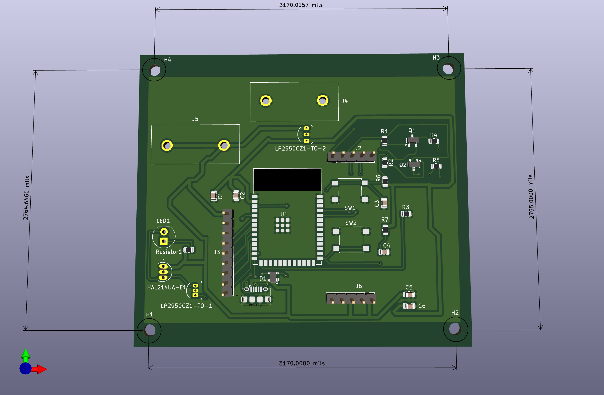

# 🎵 Automatic Vinyl Record Flipper

I love vinyl records.

But as a 21st century kid, I may be too lazy for the repeated getting up and down required to continue playback of music every few minutes or so. I love my record collection, but I just wish that, after I put the record on, it would just play the entire album.

So, we took matters into our own hands and built an **automatic vinyl record flipper**.

Included are:
- 🛠️ **PCB Design Files**
- 💻 **The program code**
- 📷 **A picture and video for your enjoyment**

Hopefully, you enjoy it as much as I did.

---

## 🧠 What It Does

This device automatically flips a vinyl record by sending PWM signals to servo motors using an ESP32 microcontroller once it finishes playing a side. It detects the tonearm rest position using a Hall effect sensor, then lifts, rotates, and drops the record back down.

---

## 🖼️ Project Gallery

### 🔧 PCB Preview  


### 📸 Final Project Photo  


---

## 📁 Folder Structure

```bash
VinylRecordFlipper/
├── PCB_Design/                     # KiCad schematic, layout, and Gerbers
│   └── PCB_preview.png
├── Image_and_Video/                # Demo photo and video of the final product
│   └── project_photo.jpeg
├── Record_Flipper_Program.ino      # ESP32 code (Arduino-compatible)
└── README.md                       # You're here
